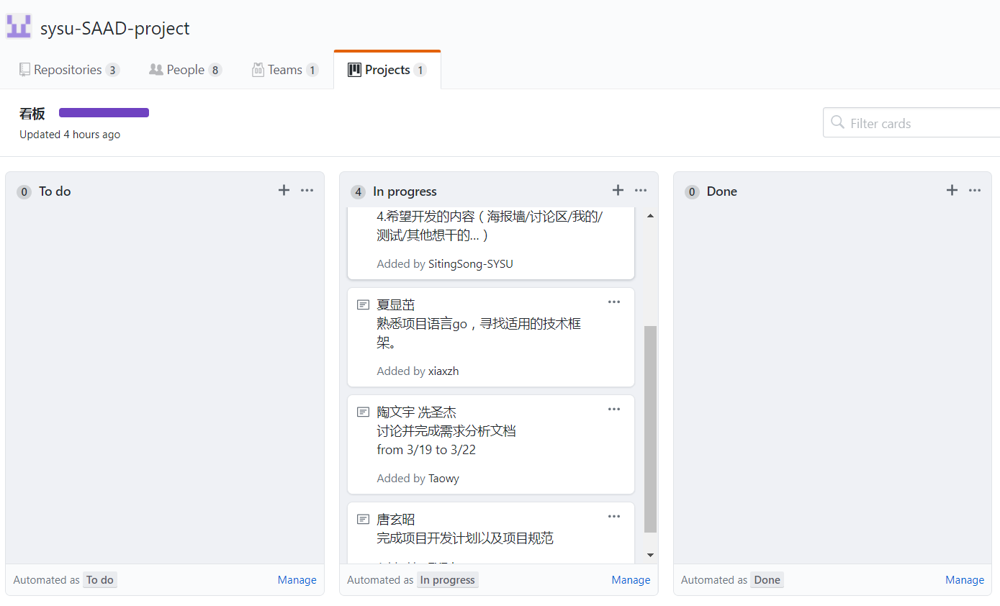

# 系统分析与设计-lesson-2

> 15331323 2018-3-21

## 1.简答题

   - 简述瀑布模型、增量模型、螺旋模型（含原型方法）的优缺点。
     - 瀑布模型
       - 优点：定义了软件开发基本流程与活动（在假设需求是明确的，在短期内可获取每个阶段是无差错的）
       - 缺点：
       - 1. 依赖问题：下一阶段的工作依赖上一阶段的产出，一旦产出出现了失误，就可能这个阶段难以完成。
         2. 容错问题：在后期发现需求问题，工作量会很巨大。
         3. 资源调配问题：知识技能需求不同、人员数量要求不同。
     - 增量模型
       - 优点：采用增量模型的优点是人员分配灵活，刚开始不用投入大量人力资源。如果核心产品很受欢迎，则可增加人力实现下一个增量。当配备的人员不能在设定的期限内完成产品时，它提供了一种先推出核心产品的途径。这样即可先发布部分功能给客户，对客户起到镇静剂的作用。此外，增量能够有计划地管理技术风险。
       - 缺点：
         1. 由于各个构建是逐渐并入已有的软件体系中的，所以加入构建必须不破坏已构建好的系统部分，这需要具备开放式的体系结构。
         2. 在开发过程中，需求的变化是不可避免的。增量模型的灵活性可以使其适应这种变化的能力大大优于瀑布模型和快速原型模型，但也很容易退化为边做边改模型，从而使软件过程的控制失去整体性。
         3. 如果增量包之间存在相交的情况且未很好处理，则必须做全盘系统分析，这种模型将功能细化后分别开发的方法较适应于需求经常改变的软件开发过程。
     - 螺旋模型（含原型方法）
       - 优点：
         1. 设计上的灵活性,可以在项目的各个阶段进行变更。
         2. 以小的分段来构建大型系统,使成本计算变得简单容易。
         3. 客户始终参与每个阶段的开发,保证了项目不偏离正确方向以及项目的可控性。
         4. 随着项目推进,客户始终掌握项目的最新信息 , 从而他或她能够和管理层有效地交互。
         5. 客户认可这种公司内部的开发方式带来的良好的沟通和高质量的产品。
       - 缺点：
         1. 采用螺旋模型需要具有相当丰富的风险评估经验和专门知识，在风险较大的项目开发中，如果未能够及时标识风险，势必造成重大损失。
         2. 过多的迭代次数会增加开发成本，延迟提交时间。简述UP的三大特点，其中那些内容体现了用户驱动的开发，那些内容体现了风险驱动的开发？
   - 简述 UP 的三大特点，其中哪些内容体现了用户驱动的开发，哪些内容体现风险驱动的开发？
     1. 用例驱动（Use Case Driven）-- 用户驱动开发。
     2. 以体系结构为核心（Architecture Centric）-- 风险驱动开发。
     3. 迭代及增量（Iterative and Evolutionary）-- 用户驱动开发。

   - UP四个阶段的划分准则是什么？关键的里程碑是什么？
     - 准则：每个阶段结束于一个主要的里程碑 (Major Milestone)，并在阶段结尾执行一次评估以确定这个阶段的目标是否已经满足。如果评估结果令人满意的话，可以允许项目进入下一个阶段。
     - 里程碑：
       1. 初始阶段（Inception）：生命周期目标里程碑。
       2. 精化阶段（Elaboration）：生命周期体系结构里程碑。
       3. 构建阶段（Construction）：初始运行能力里程碑。
       4. 交付阶段（Transition）：产品发布里程碑。
   - IT项目管理中，“工期、质量、范围/内容”三个元素中，在合同固定条件下，为什么说“范围/内容”是项目团队易于控制的？
     - 在IT项目中，合同已经提前将工期与质量用白纸黑字确定下来了，只有范围/内容是可以在开发过程遇到问题的时候与客户协商，然后做出相应的调整。
   - 为什么说，UP为企业按固定节奏生产、固定周期发布软件产品提供了依据？
     - 降低了在一个增量上的开支风险。如果开发人员重复某个迭代，那么损失只是这一个开发有误的迭代的花费。
     - 加快了整个开发工作的进度。因为开发人员清楚问题的焦点所在，他们的工作会更有效率。
     - 由于用户的需求并不能在一开始就作出完全的界定，它们通常是在后续阶段中不断细化的。因此，迭代过程这种模式使适应需求的变化会更容易些。

## 2. 项目管理使用
   - 使用截图工具（png格式输出），展现你团队的任务Kanban，请注意以下要求
     - 每个人的任务是明确的。即一周后可以看到具体成果
     - 每个人的任务是1-2项。
     - 至少包含一个团队活动任务。

     >  如图所示：
     >
     > 

